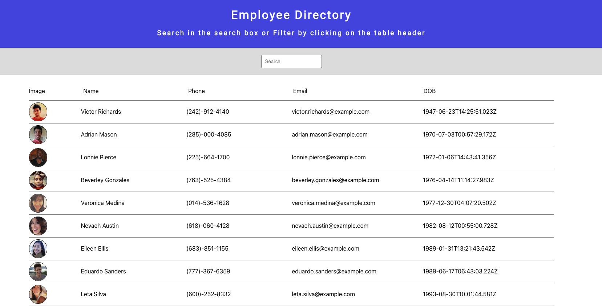

<h1 align="center">
   
  <!-- image/logo link -->
  
   
  Employee Directory
   
</h1>

<h4 align="center">
<!-- Description of Project -->
Simplify organizing and finding the employees in your company.
</h4>

<!-- List of Contributors -->
Employee Directory is brought to you by <a href="https://github.com/mitchellmunderwood" target="_blank">Mitchell Underwood</a>.

Employee Directory is currently deployed with heroku at <a href="https://employee-directory-mu.herokuapp.com/">employee-directory-mu.herokuapp.com/</a>.

<!-- line for badges -->
    
    
    
    
 
<!-- line for badges -->
    
    

    <!-- table of contents -->
  <a href="#gallery">Gallery</a> •
  <a href="#description">Description</a> •
  <a href="#license">License</a> •
  <a href="#installation">Installation</a> •
  <a href="#usage">Usage</a> •
  <a href="#questions">Questions</a> •
  <a href="#contributing">Contributing</a> •
  <a href="#acknowledgements">Acknowledgements</a>

 
 
 
 
 
 
 
 
 
 
 
 
 
 
 
 

## Gallery

    
 

## Description

Employee Directory is a clean & simple React application that will randomly generate a table of 10 employees. This table is able to be searched through inputs in the search bar, which will filter across every criteria. Sorting is possible by clicking the table header by which to sort. Soring occurs in ascending order only.

## License

Employee Directory is licensed under the terms of the [MIT License](https://opensource.org/licenses/MIT) and is available for free.

## Installation

Clone this repo to your desktop and run `npm install` to install all the dependencies.

## Usage

This project was bootstrapped with [Create React App](https://github.com/facebook/create-react-app).

###### Available Scripts

In the project directory, you can run:

###### `nodemon serve.js`

Runs the app in the development mode. 
Open [http://localhost:3000](http://localhost:3000) to view it in the browser.

The page will reload if you make edits. 
You will also see any lint errors in the console.

## Questions

For additional questions, email Mitchell Underwood at ***mitchellmunderwood@gmail.com***

## Contributing

Want to contribute? Great!

To fix a bug or enhance an existing feature, follow these steps:

- Fork the repo
- Create a new branch `git checkout -b improve-feature`
- Make the appropriate changes in the files
- Commit your changes `git commit -am 'Improve feature'`
- Push to the branch `git push origin improve-feature`
- Create a Pull Request

## Contributors

|                                                                      | Name               | Github                                                     | LinkedIn                                                                         | Portfolio                                                    |
| -------------------------------------------------------------------- | ------------------ | ---------------------------------------------------------- | -------------------------------------------------------------------------------- | ------------------------------------------------------------ |
|  | Mitchell Underwood | <a href="https://github.com/mitchellmunderwood">Github</a> | <a href="https://www.linkedin.com/in/mitchell-underwood-295455122/">LinkedIn</a> | <a href="https://mitchellmunderwood.github.io/">Porfolio</a> |

## Acknowledgements

This project utilizes the following open source tools:

- [React.js](https://reactjs.org/)
- [Random User Generator](https://randomuser.me)
